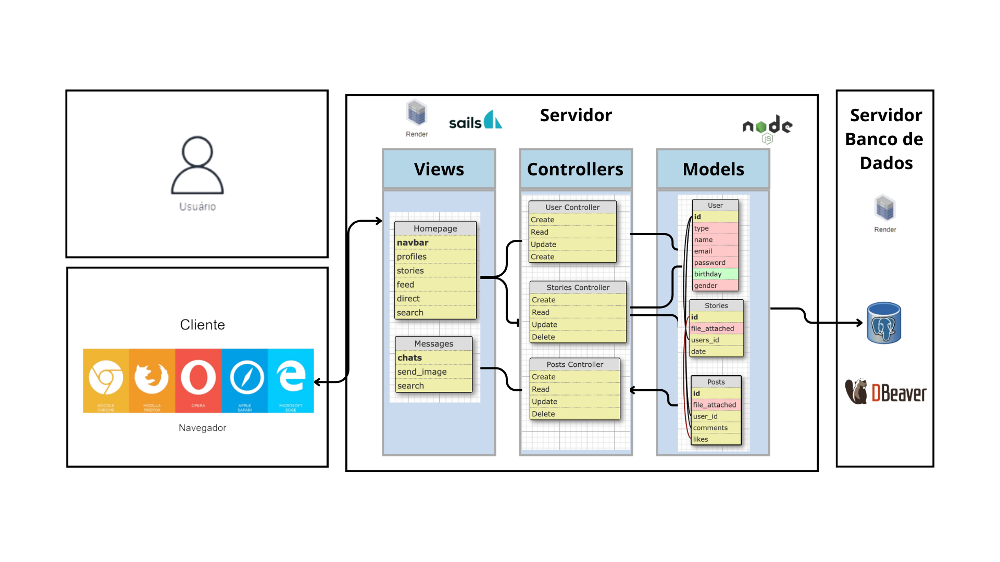

# Ponderada 2: Arquitetura MVC

Figura 01 - Arquitetura MVC

Fonte: Material produzido pelo autor (2024)

# Arquitetura MVC
- Nome do Projeto: Photogram
- Descrição: Um clone do Instagram.
- Arquitetura: MVC (Model-View-Controller)
- Ferramenta de Diagramação: Para criação das tabelas: kitt.lewagon.com/db, para edição da imagem: canva.com

## Modelos (Models):
### User:
Possui campos essenciais para um modelo de usuario, como nome, email, senha e data de nacimento. Seu ID é utilizado em outros modulos.
### Stories:
Stories model possuí um arquivo anexado (imagem do story), data e um user_id que referencia quem criou aquele Storie.
### Posts:
Posts model possuí tambem um arquivo de imagem anexado, um user_id do criador, comentarios e likes.

## Controladores (Controllers):
### User Controller
Possuí a função de controlar o banco de dados alimentado pelo modelo User, com funçōes de:

- **create**: Cria um novo usúario no banco;

- **read**: Lê o banco de dados, pode ser realizado filtros (por exemplo procurar o usuario com ID = 1) e retorna essa(s) instancia(s) para a view;

- **update**: Atualiza alguma informação do User;

- **delete**: Deleta alguma instancia de User;

### Stories Controller
Possuí a função de controlar o banco de dados alimentado pelo modelo Stories, com funçōes de:

- **create**: Cria um novo Storie no banco;

- **read**: Lê o banco de dados, pode ser realizado filtros (por exemplo procurar o storie criado pelo usuario de ID = 1) e retorna essa(s) instancia(s) para a view;

- **update**: Atualiza alguma informação de Stories;

- **delete**: Deleta alguma instancia de Stories;

### Posts Controller
Possuí a função de controlar o banco de dados alimentado pelo modelo Posts, com funçōes de:

- **create**: Cria um novo Post no banco;

- **read**: Lê o banco de dados, pode ser realizado filtros (por exemplo procurar os posts criados na data de hoje) e retorna essa(s) instancia(s) para a view;

- **update**: Atualiza alguma informação do Post;

- **delete**: Deleta alguma instancia de Post;

#### Interação dos controllers
- Os controllers realizam as funções CRUD (create, read, update, delete), responsaveis por fazer todas as operações mais basicas relacionadas a criação e manutenção de instâncias no banco de dados (essas definidas pelos modelos). Além de tambem ser capaz de ler de forma dinamica (filtrando) o banco de dados e retornar essas informações à view pertinente.

### Views (Views):
- **HomePage:** Essa é o centro da aplicação, nessa view é mostrado uma navbar com diversas funções, stories, feed(conjunto de posts), direct, search...
- **Messages** Essa é a area que mostra as mensagens trocadas entre usuarios, sendo possivel procurar usuarios digitando seu nome em um campo de pesquisa, enviar mensagens e fotos...

### Infraestrutura:

#### Banco de Dados:
- **PostgreSQL**: Utilizado como o sistema de banco de dados principal devido à sua robustez, confiabilidade e suporte para grandes volumes de dados e transações complexas. A integração com o modelo MVC é feita através dos Models, onde cada tabela no PostgreSQL corresponde a um Model no código.

#### Servidores:
- **Servidores de Aplicação**: Responsáveis por hospedar a lógica de negócios e a interface de usuário. Eles processam solicitações, executam operações de controle e entregam dados processados para as Views, nesse caso será utilizado o Render.

#### APIs Externas:
- **Serviços de Armazenamento de Imagens**: APIs externas para armazenamento de arquivos como Amazon S3 ou Google Cloud Storage são usadas para gerenciar o upload e armazenamento de imagens, tirando esta responsabilidade do servidor principal.

#### Dependências:
- **Frameworks e Bibliotecas**: Utilização de frameworks como Sails.js no backend para roteamento e processamento dos dados do banco, além de bibliotecas para ORM como Sequelize, que facilita a interação com o banco de dados PostgreSQL.

### Justifique as escolhas feitas e como elas impactam o projeto.

#### Implicações da Arquitetura:
- **Escalabilidade**: O uso de PostgreSQL permite escalabilidade, essencial para lidar com o crescimento do número de usuários e dados. A arquitetura MVC facilita a distribuição da carga entre diferentes servidores e componentes, além de facilitar a manutenção do app.

- **Manutenção**: A clara separação de responsabilidades no MVC permite atualizações e manutenção independentes nas diferentes partes do sistema, reduzindo o risco de efeitos colaterais em atualizações e facilitando a gestão de código.

- **Testabilidade**: Cada componente do MVC pode ser testado independentemente, o que aumenta a eficácia dos testes e reduz o tempo para detecção de bugs.

- **Segurança**: Utilizar um sistema de gerenciamento de banco de dados robusto como o PostgreSQL ajuda a garantir a segurança dos dados, com suporte para controle de acesso, backup e recuperação de desastres.

#### Impacto no Projeto:
- As escolhas de tecnologia e arquitetura foram feitas com o objetivo de construir um sistema confiável, escalável e fácil de manter, essencial para um projeto que visa replicar funcionalidades complexas e de alta demanda como as de um clone do Instagram.
